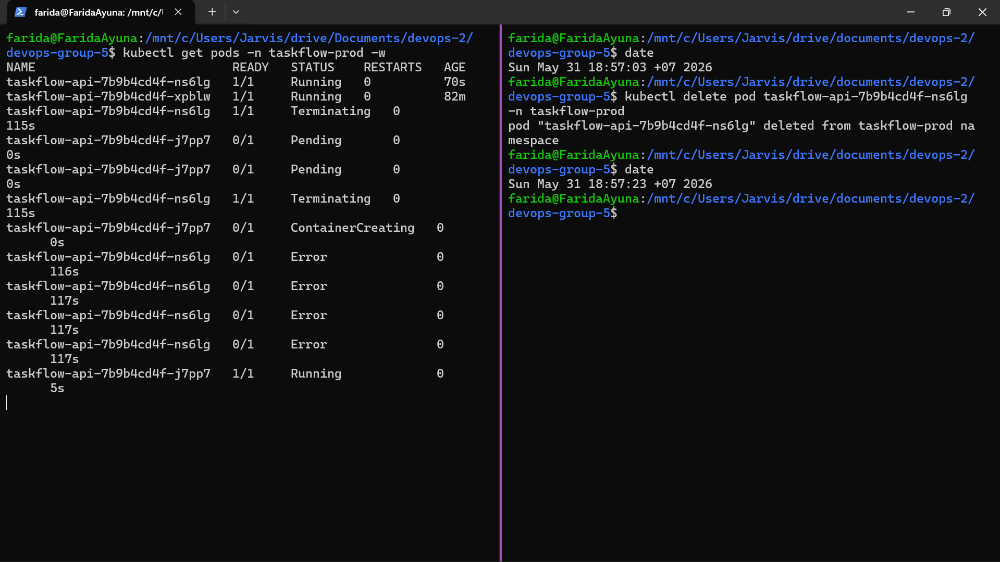

# 👩🏻‍💻CI/CD Pipeline Challenge - Operasional Pengembang A

**Anggota Kelompok 5:**
| No. | Nama Mahasiswa | NRP Mahasiswa |
|:---:|---|:---:|
| 1. | Chelsea Vania Haryono | 5027231003 |
| 2. | Salsabila Rahmah | 5027231005 |
| 3. | Farida Qurrotu ‘Ayuna | 5027231015 |
| 4. | Nayla Raissa Zahra | 5027231054 |
| 5. | Adlya Isriena Aftarisya | 5027231066 |
| 6. | Aisyah Rahmasari | 5027231072 |
| 7. | Nayyara Ashila | 5027231083 |
<br>

---

<br>

## 1. Tool CI/CD yang Digunakan
Pada project ini digunakan **GitLab CI/CD** pada platform *gitlab.com* untuk membangun pipeline *Continuous Integration* dan *Continuous Deployment* (CI/CD) secara otomatis.

| Komponen | Teknologi |
|---|---|
| Version Control | Git |
| Platform CI/CD | GitLab CI/CD |
| Bahasa Pemrograman | Go 1.22 |
| Containerization | Docker |
| Database | PostgreSQL 16 |
| Registry | GitLab Container Registry |
| Notification | Telegram Notification |


<br>

## 2. Diagram Alur Pipeline
Pipeline terdiri dari tahapan CI dan CD. Tahapan CI berfokus pada proses validasi kode seperti *static analysis*, *unit test*, *integration test*, dan *coverage check*. Setelah seluruh tahap CI berhasil, pipeline melanjutkan proses CD berupa Docker *build*, *push image* ke *registry*, *deployment*, *smoke test*, dan notifikasi *deployment*.
Pipeline berjalan otomatis setiap terdapat *push* atau *pull request* pada branch `main` maupun `develop`.


<br>

## 3. Perbaikan Bug dan Pengujian — Skenario 1
Pada skenario ini, aplikasi TaskFlow ditemukan memiliki beberapa bug pada logika aplikasi dan validasi data. Bug berhasil dideteksi melalui unit test dan *integration test* yang dijalankan secara otomatis oleh pipeline CI/CD.

| Nomor | File | Baris | Kode Salah | Kode Benar | Nama Test |
|:---:|---|:---:|---|---|---|
| Bug #1 | `internal/service/service.go` | 172 | `return float64(completed/len(tasks))*100` | `return (float64(completed)/float64(len(tasks)))*100` | `TestCalculateCompletionRate` |
| Bug #2 | `internal/repository/postgres.go` | 113 | `WHERE status != $1` | `WHERE status = $1` | `TestPostgres_FindByStatus_HanyaTodo` |
| Bug #2 | `internal/repository/memory.go` | 58 | `if t.Status != status` | `if t.Status == status` | `TestFindByStatus_HanyaTodo` |
| Bug #3 | `internal/validator/validator.go` | 15 | terdapat `"urgent": true` | menghapus `"urgent"` | `TestIsValidPriority` |
<br>

**Penjelasan Bug:**
1. **Bug #1**  
   *Integer division* pada `CalculateCompletionRate`. Ketika menghitung persentase task selesai, pembagian dilakukan antar integer sehingga hasil selalu `0` kecuali seluruh task selesai.
2. **Bug #2**  
   Operator filter terbalik pada repository memory dan PostgreSQL. Kondisi `!=` menyebabkan hasil filter tidak sesuai dengan status yang diminta.
3. **Bug #3**  
   Validator menganggap `"urgent"` sebagai priority yang valid, padahal database PostgreSQL hanya menerima: `low`, `medium`, `high`

Pengujian dilakukan menggunakan:

```bash
go test ./... -v
```
dan:
```bash
go test -race ./...
```
Hasil pengujian menunjukkan seluruh test berhasil dijalankan dan *coverage* memenuhi batas minimum 75%.
<br>

## 4. Pipeline CI/CD — Skenario 2
**A. Pipeline Merah**


Pipeline dijalankan otomatis saat terdapat *push* pada branch `main` maupun `develop`. Pada pengujian ini, salah satu bug dimasukkan kembali ke dalam kode untuk membuktikan bahwa pipeline dapat mendeteksi error secara otomatis. Akibatnya, pipeline gagal pada tahap:
1. `go test -race ./...`
2. `go test -tags=integration -race ./...`
Karena unit test dan *integration test* mendeteksi error pada logika aplikasi, pipeline ditandai merah sehingga proses *build* dan *deployment* dibatalkan.

**B. Pipeline Hijau**


Pipeline berhasil berjalan otomatis setelah bug diperbaiki kembali. Seluruh tahapan CI berhasil dilewati, meliputi:
1. Trigger otomatis pada *push/pull request*
2. `go vet`
3. Unit test dengan *race detector*
4. *Integration test* menggunakan PostgreSQL service container
5. *Coverage check* ≥ 75%
6. `go build`
7. Penyimpanan *coverage report* sebagai artifact
Karena seluruh stage berhasil tanpa error, pipeline ditandai hijau dan proses Docker build dapat dilanjutkan.

<br>

## 5. Perbandingan Docker Image — Skenario 3
Pada skenario ini, Docker image dibangun menggunakan *multi-stage build* agar ukuran image lebih kecil dan lebih efisien dibandingkan metode *single-stage build*.

| Metode Build | Base Image | Ukuran Image | Keterangan |
|:---:|:---:|:---:|:---:|
| *Single-stage* | `golang:1.22 / 1.25` | ~800 MB | Membawa seluruh Go toolchain, OS libraries, dan build tools |
| *Multi-stage* | `scratch` | ~10.5 MB | Hanya binary + CA certificates |

**🤔❔Mengapa Perbedaannya Sangat Besar?**

| Aspek | `FROM golang:1.25` | Multi-stage → `scratch` |
|:---:|:---:|:---:|
| OS Base | Debian (~150 MB) | Tidak ada OS |
| Go Toolchain | ~500 MB | Tidak dibawa ke runtime |
| System Libraries | libc, openssl, apt, dll | Tidak ada |
| Binary Aplikasi | ~15 MB | ~10.3 MB |
| CA Certificates | Sudah tersedia | Di-copy manual |
| Total | ~800 MB | ~10.5 MB |

Penggunaan *multi-stage build* menghasilkan image yang lebih ringan, lebih cepat di-*pull*, dan lebih aman karena tidak membawa sistem operasi maupun *build tools* tambahan.

<br>

## 6. Docker Registry dan Tagging Image
Tag SHA digunakan untuk identifikasi setiap commit, sedangkan tag `stable` digunakan untuk versi yang telah lolos seluruh tahapan pipeline.

**URL Registry:** *[registry.gitlab.com/adlyatarisa/devops-group-5](https://gitlab.com/adlyatarisa/devops-group-5)*


<br>

## 7. Smoke Test dan Notifikasi — Skenario 4
Setelah proses *deployment*, pipeline menjalankan *smoke test* untuk memastikan aplikasi berjalan dengan baik sebelum deployment dianggap berhasil.

Endpoint yang diuji:
- `/health`
- `/api/v1/stats`

Contoh *smoke test*:
```bash
curl -f http://localhost:8080/health
curl -f http://localhost:8080/api/v1/stats
```
Pipeline akan terus mencoba melakukan pengecekan endpoint hingga server siap digunakan. Jika endpoint gagal diakses dalam batas waktu tertentu, pipeline otomatis ditandai gagal.


Pada pengujian ini, endpoint sengaja dibuat salah sehingga *smoke test* gagal dijalankan. Pipeline mendeteksi bahwa server tidak memberikan respons yang valid sehingga proses deployment dihentikan secara otomatis. Hal ini menunjukkan bahwa *smoke test* membantu memastikan aplikasi benar-benar berjalan sebelum digunakan.

Selain *smoke test*, pipeline juga terintegrasi dengan notifikasi Telegram untuk memberikan informasi status deployment secara otomatis. Notifikasi yang dikirim meliputi:
- ✅ *Deployment berhasil*
- ❌ *Deployment gagal*
- commit SHA
- link pipeline GitLab


Dengan adanya notifikasi otomatis, tim dapat mengetahui status pipeline dan deployment secara *real-time* tanpa perlu membuka GitLab secara manual.

<br>

## 8. Strategi Rollback — Skenario 5
Strategi *rollback* digunakan untuk mengembalikan aplikasi ke versi sebelumnya ketika deployment terbaru mengalami error. Pada implementasi ini, setiap Docker image diberikan tag SHA sehingga setiap versi aplikasi dapat dilacak dengan jelas. Selain itu, digunakan juga tag `stable` untuk menandai versi yang telah berhasil melewati seluruh tahapan pipeline.

Contoh perintah *rollback*:

```bash
make rollback ROLLBACK_TAG=sha-12b52ae
```
Langkah *rollback*:
1. Pull image dari registry
2. Menghentikan container lama
3. Menjalankan container versi sebelumnya
4. Menjalankan *health check*

Dengan strategi ini, proses pemulihan aplikasi dapat dilakukan lebih cepat dan konsisten dibandingkan deployment manual. Pada pengujian rollback, aplikasi dapat dikembalikan ke versi sebelumnya menggunakan tag SHA yang tersedia pada GitLab Container Registry.

<br>

## 9. Audit Keamanan Pipeline — Skenario 6
Pipeline dilengkapi dengan beberapa proses *security scanning* untuk meningkatkan keamanan aplikasi, dependency, dan Docker image sebelum proses *deployment* dilakukan. Seluruh proses scanning dijalankan otomatis melalui GitLab CI/CD sehingga potensi vulnerability dapat dideteksi lebih awal.

### 9.1 SCA (*Dependency Scanning*): 
Pada tahap ini dilakukan scanning terhadap dependency aplikasi menggunakan **Trivy** untuk mendeteksi vulnerability pada package yang digunakan. Log job `sca-dependency-scan` menunjukkan hasil **"No vulnerabilities found"** serta menyediakan artifact berupa `sca-report.json`.


Scanning dilakukan untuk mendeteksi vulnerability pada dependency aplikasi. Hasil menunjukkan tidak ditemukan vulnerability dengan severity **HIGH** maupun **CRITICAL**.


### 9.2 SAST (*Source Code Scanning*):
Tahap SAST dilakukan menggunakan **Gosec** untuk menganalisis source code dan mendeteksi potensi celah keamanan seperti:
- hardcoded credential
- SQL injection
- insecure coding pattern

Log job `sast-code-scan` menunjukkan ringkasan **"Issues: 0"** setelah dilakukan filtering severity tinggi.


Hasil scanning menunjukkan tidak ditemukan issue dengan severity tinggi pada source code aplikasi.


Selain itu, dilakukan juga pengujian *false positive* untuk memastikan hasil scanning tetap relevan dan tidak menghasilkan deteksi yang keliru.
##### *False Positive* (Kategori B - SAST)


### 9.3 Secret Scanning
Secret scanning dilakukan menggunakan **Gitleaks** untuk mendeteksi password, token, maupun credential rahasia yang tidak sengaja dimasukkan ke dalam repository. Log job `secret-scanning` di GitLab menunjukkan hasil **"no leaks found"**.


Selain melalui pipeline GitLab, secret scanning juga diterapkan sebagai *pre-commit hook* pada local development environment. Ketika terdapat credential palsu yang sengaja dimasukkan saat pengujian, proses commit otomatis ditolak. Pipeline berhasil mendeteksi secret palsu yang dimasukkan saat pengujian sehingga membantu mencegah kebocoran credential ke repository.


Dilakukan juga pengujian *true positive* menggunakan Gitleaks untuk memastikan scanning dapat mendeteksi secret secara valid.
##### *True Positive* (Kategori C - Gitleaks)


### 9.4 Container Image Scanning
Container image scanning dilakukan menggunakan **Trivy** untuk memeriksa vulnerability pada Docker image yang telah dibangun. Log job `container-scanning` di GitLab menampilkan *Report Summary* dengan hasil **0 Vulnerabilities**.


Hasil scanning menunjukkan image berbasis `scratch` memiliki vulnerability yang sangat rendah karena tidak membawa sistem operasi maupun package tambahan.


## 10. Refleksi
Implementasi GitLab CI/CD membantu proses *testing*, *build*, dan *deployment* menjadi lebih otomatis dan konsisten. Dengan adanya pipeline otomatis, bug dapat dideteksi lebih cepat sebelum aplikasi di-*deploy* sehingga risiko *human error* dapat dikurangi.

GitLab CI/CD memiliki beberapa keunggulan, antara lain:
1. *Pipeline automation* terintegrasi langsung dengan repository GitLab
2. Mendukung *container registry* dalam satu platform
3. Mendukung *artifact management* dan *security scanning*
4. Memiliki fitur *stages* dan *environments* yang memudahkan pengelolaan *deployment* staging maupun production

Dibandingkan tool kelompok lain, GitLab CI/CD memiliki integrasi yang lebih lengkap karena proses CI/CD, registry, dan monitoring pipeline tersedia dalam satu platform. Hal ini membuat konfigurasi pipeline lebih terpusat dibandingkan Jenkins yang membutuhkan plugin tambahan atau GitHub Actions yang lebih bergantung pada marketplace eksternal.

Namun, GitLab CI/CD juga memiliki beberapa keterbatasan. Konfigurasi pipeline menggunakan YAML cukup kompleks dan memerlukan proses debugging yang cukup panjang ketika terjadi error pada stage tertentu. Selain itu, beberapa tool lain seperti GitHub Actions memiliki komunitas dan dokumentasi yang lebih besar, sedangkan Jenkins memiliki fleksibilitas lebih tinggi untuk konfigurasi *custom pipeline*.

Secara keseluruhan, GitLab CI/CD cocok digunakan untuk implementasi DevOps modern karena mendukung proses *automation*, *testing*, *deployment*, hingga *security scanning* dalam satu ekosistem yang terintegrasi.


## Kubernetes — Cara Menjalankan Lokal
Link Youtube Demo: [Kelompok 5 - DevOps](https://youtu.be/voJfOm4jyyg)

### Prasyarat
- [Docker Desktop](https://www.docker.com/products/docker-desktop/) sudah terinstall dan running
- [Minikube](https://minikube.sigs.k8s.io/docs/start/) sudah terinstall
- [kubectl](https://kubernetes.io/docs/tasks/tools/) sudah terinstall

### 1. Start Minikube
```bash
minikube delete   # hapus cluster lama jika ada
minikube start --driver=docker --cpus=2 --memory=4096
```

### 2. Buat Namespace
```bash
kubectl apply -f kubernetes/namespace-dev.yaml
kubectl apply -f kubernetes/namespace-prod.yaml
```

### 3. Deploy Aplikasi
```bash
kubectl apply -f kubernetes/deployment.yaml
kubectl apply -f kubernetes/service.yaml
```

### 4. Akses Aplikasi
```bash
minikube service taskflow-api -n taskflow-dev
```
Terminal harus tetap terbuka selama mengakses aplikasi.

### 5. Cek Status
```bash
# Cek namespace
kubectl get namespaces

# Cek pod berjalan
kubectl get pods -n taskflow-dev

# Cek service
kubectl get service -n taskflow-dev
```

### 6. Verifikasi Endpoint
```bash
# Ganti PORT dengan angka yang muncul saat minikube service
curl http://127.0.0.1:<PORT>/health
curl http://127.0.0.1:<PORT>/api/v1/stats
```

## Kubernetes — Testing Self-Healing



Pengujian dilakukan untuk membuktikan kemampuan Kubernetes dalam melakukan **self-healing** terhadap Pod yang mengalami kegagalan atau dihapus secara manual

a. Langkah Pengujian

1. Memantau status Pod secara real-time pada terminal 1 (kiri):

   ```bash
   kubectl get pods -n taskflow-prod -w
   ```

2. Menghapus salah satu Pod yang sedang berjalan pada terminal 2 (kanan):

   ```bash
   kubectl delete pod taskflow-api-7b9b4cd4f-7trqq -n taskflow-prod
   ```

b. Hasil

Setelah Pod dihapus, Kubernetes secara otomatis membuat Pod baru dalam durasi **± 20 detik** seperti yang terlihat pada gambar, sehingga mekanisme kubernetes nya berhasil.

<br>


### Tugas 6 — Isolasi Namespace

**Langkah-langkah yang dilakukan:**

1. **Memastikan Minikube dan Namespace siap:**
   Membuat 2 namespace terpisah, yaitu `taskflow-dev` dan `taskflow-prod`.
   ```bash
   minikube start
   kubectl create namespace taskflow-dev
   kubectl create namespace taskflow-prod
   ```

2. **Mengisi Namespace dengan Aplikasi:**
   - Di `taskflow-prod`, menjalankan skrip deployment utama: `bash deploy.sh`.
   - Di `taskflow-dev`, membuat aplikasi *dummy* yang akan menjadi target penghancuran:
     ```bash
     kubectl create deployment aplikasi-dev-dummy --image=nginx -n taskflow-dev
     ```

3. **Membuat "Kekacauan" di Lingkungan Dev:**
   Menghapus semua Pod secara paksa di lingkungan development untuk mensimulasikan kegagalan sistem:
   ```bash
   kubectl delete pods --all -n taskflow-dev
   ```

4. **Pembuktian / Verifikasi:**
   Membuktikan bahwa lingkungan production (`prod`) sama sekali tidak terpengaruh oleh kekacauan di `dev`.
   ```bash
   kubectl get pods -n taskflow-prod
   curl http://$(minikube ip):30080
   ```
   **Hasil:** Seluruh Pod di `taskflow-prod` tetap berstatus **Running** dengan usia *uptime* yang tidak terputus, dan perintah `curl` tetap merespons dengan normal. Ini membuktikan bahwa isolasi antar *namespace* berfungsi secara sempurna.

