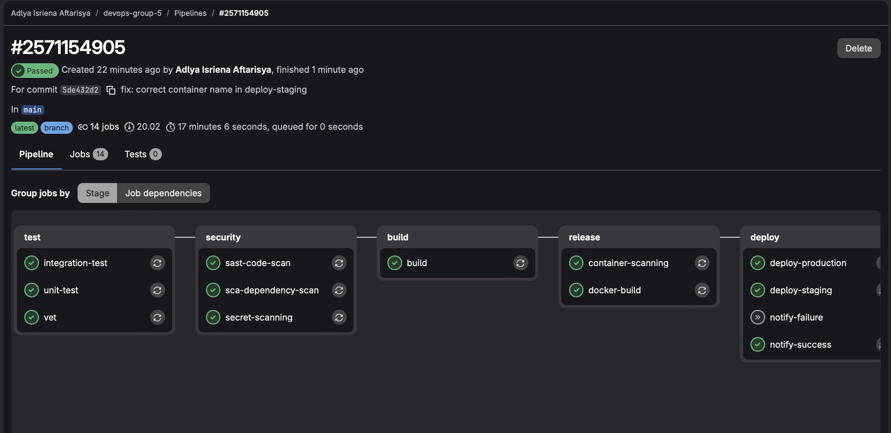
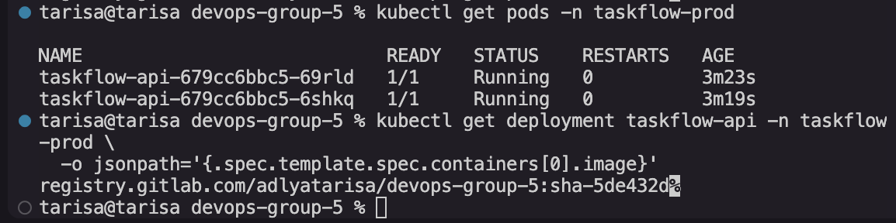

# Dokumentasi: Integrasi CI/CD ke Kubernetes

## 1. Screenshot Pipeline CI/CD (Semua Job Hijau)



## 2. Screenshot kubectl get pods (Image Baru Berjalan)



## 3. Diagram Alur CI/CD ke Kubernetes

```
Developer push kode ke GitHub
        │
        ▼
GitHub (mirror.yml)
  └─ otomatis push ke GitLab
        │
        ▼
GitLab CI (.gitlab-ci.yml)
  ├─ go vet
  ├─ unit-test
  ├─ integration-test
  ├─ sca-dependency-scan
  ├─ sast-code-scan
  ├─ secret-scanning
  ├─ build (binary)
  ├─ docker-build → push ke registry.gitlab.com (multi-arch amd64+arm64)
  ├─ container-scanning (Trivy)
  │
  └─ deploy-staging (auto)
        │  kubectl set image deployment/taskflow-api
        │  -n taskflow-dev
        │
        ▼
  deploy-production (manual) 
        │  kubectl set image deployment/taskflow-api
        │  -n taskflow-prod
        │
        ▼
  Kubernetes Rolling Update otomatis
  tanpa downtime ✅
```

## 4. Jawaban Pertanyaan

### Apa yang terjadi di Kubernetes jika job `build` di pipeline gagal? Apakah deployment tetap berjalan?

Tidak. Job `deploy-staging` di pipeline memiliki `needs: ["docker-build", "container-scanning"]`, dan `docker-build` sendiri membutuhkan job `build` selesai terlebih dahulu. Jika job `build` gagal, `docker-build` tidak akan jalan, sehingga `deploy-staging` juga tidak akan dieksekusi. Kubernetes tidak mendapat perintah update apapun, sehingga deployment yang sedang berjalan tetap menggunakan image lama yang stabil — tidak ada perubahan.

### Mengapa kita pakai `needs: build` di job `deploy`?

Karena kita hanya boleh deploy image yang sudah terbukti berhasil dibangun dan lolos semua tahap pengujian. `needs` memastikan urutan eksekusi yang benar — deploy hanya jalan setelah build, test, dan push image ke registry selesai dengan sukses. Ini mencegah deployment image yang cacat atau belum siap ke production.

### Apa bedanya pendekatan ini dengan cara deploy manual yang lama?

| Aspek | Manual (Lama) | CI/CD + Kubernetes (Baru) |
|-------|---------------|--------------------------|
| Trigger deploy | SSH ke server, jalankan perintah manual | Otomatis setiap push ke `main` |
| Waktu deploy | 10-30 menit (manual) | < 2 menit (otomatis) |
| Risiko human error | Tinggi | Rendah |
| Downtime | Ada (container harus distop dulu) | Tidak ada (rolling update) |
| Rollback | Manual, ~25 menit | Satu perintah, < 60 detik |
| Konsistensi | Bergantung siapa yang deploy | Selalu sama, reproducible |
