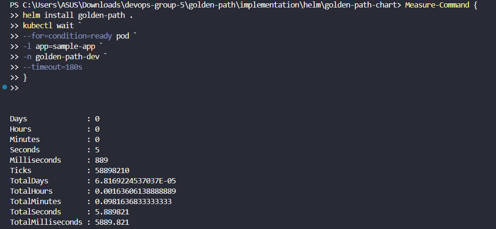
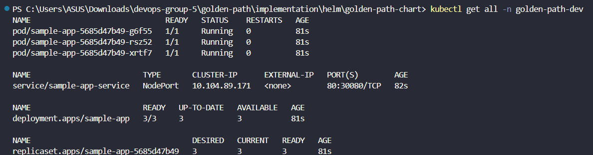

# Metrics After (Helm Golden Path)

Mengukur waktu deployment menggunakan **Helm Chart (Golden Path)**.

## Pengujian

```powershell
Measure-Command {
    helm install golden-path .
    kubectl wait `
    --for=condition=ready pod `
    -l app=sample-app `
    -n golden-path-dev `
    --timeout=180s
}
```

## Hasil
*Deployment Time*: **5.89 detik**




*Deployment* menggunakan **Helm Golden Path** berhasil dilakukan dalam waktu sekitar **5,9 detik** hingga seluruh *Pod* berada pada status **Ready**.