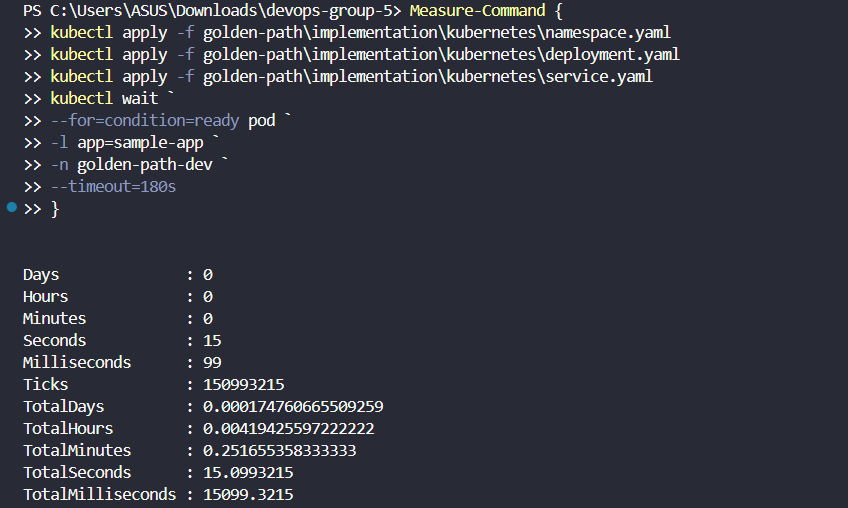

# Metrics Before (Kubernetes Manifest)
Mengukur waktu *deployment* menggunakan **Kubernetes Manifest** secara manual (`kubectl apply`).

## Pengujian
```powershell
Measure-Command {
    kubectl apply -f golden-path\implementation\kubernetes\namespace.yaml
    kubectl apply -f golden-path\implementation\kubernetes\deployment.yaml
    kubectl apply -f golden-path\implementation\kubernetes\service.yaml
    kubectl wait `
    --for=condition=ready pod `
    -l app=sample-app `
    -n golden-path-dev `
    --timeout=180s
}
```

## Hasil
*Deployment Time*: **15.1 detik**



*Deployment* menggunakan **Kubernetes Manifest** berhasil dilakukan dengan waktu sekitar **15 detik** hingga seluruh *Pod* berada pada status **Ready**.