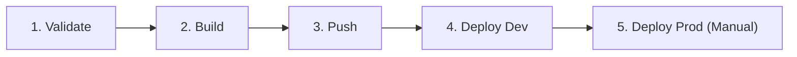

# 🛠️ Dokumentasi Teknis Implementasi Golden Path

Dokumen ini menjelaskan detail teknis implementasi komponen *Golden Path*, alur pipeline otomatisasi CI/CD, konfigurasi Helm Chart, serta kebijakan tata kelola keamanan (*governance*) yang diterapkan pada klaster Kubernetes.

---

## 📂 1. Arsitektur Struktur Folder

Komponen implementasi dikelompokkan ke dalam direktori terstruktur di bawah `golden-path/implementation/`:

```text
implementation/
├── gitlab-ci/
│   └── .gitlab-ci.yml                 # Konfigurasi pipeline otomatisasi GitLab CI/CD
├── golden-path-templates/
│   ├── deploy-dev.yaml                # Template deployment untuk lingkungan development
│   ├── deploy-prod.yaml               # Template deployment untuk lingkungan produksi
│   └── gitlab-project-template.yaml   # Blueprint template proyek untuk GitLab
├── helm/
│   └── golden-path-chart/             # Paket Helm Chart untuk self-service deployment
│       ├── Chart.yaml                 # Metadata Helm Chart
│       ├── values.yaml                # File konfigurasi parameter default
│       └── templates/                 # Manifes Kubernetes berbasis template Go
│           ├── deployment.yaml
│           ├── service.yaml
│           └── namespace.yaml
└── kubernetes/
    ├── namespace.yaml                 # Baseline namespace dev & prod
    ├── deployment.yaml                # Baseline deployment aplikasi Go
    └── service.yaml                   # Baseline service penyeimbang beban
```

---

## 🔄 2. Alur Kerja Pipeline CI/CD

Pipeline CI/CD dikonfigurasi dalam berkas `.gitlab-ci.yml` dan terdiri dari 5 tahapan utama untuk menjamin kualitas kode dan otomatisasi deployment:



1.  **Stage: `validate`**
    *   **Deskripsi**: Melakukan pengujian integritas kode dan manifes.
    *   **Proses**: Menjalankan linting pada kode Go (`go vet`), memverifikasi struktur file YAML, dan memvalidasi sintaks Helm chart menggunakan `helm lint`.
2.  **Stage: `build`**
    *   **Deskripsi**: Membangun Docker image dari aplikasi Go.
    *   **Proses**: Menggunakan *multi-stage Docker build* untuk memisahkan lingkungan kompilasi (menggunakan base image `golang:1.22`) dengan lingkungan rilis (menggunakan base image kosong `scratch`). Hal ini meminimalkan ukuran image (~10.5 MB) dan menutup celah keamanan OS.
3.  **Stage: `push`**
    *   **Deskripsi**: Mengunggah image hasil kompilasi ke GitLab Container Registry.
    *   **Proses**: Setiap image diberi tag unik berupa commit SHA (`sha-$CI_COMMIT_SHORT_SHA`) untuk kemudahan pelacakan rilis dan rollback, serta tag `stable` jika berada pada branch utama.
4.  **Stage: `deploy-dev`**
    *   **Deskripsi**: Deployment otomatis ke lingkungan *development* (`golden-path-dev`).
    *   **Proses**: Pipeline membaca template `deploy-dev.yaml`, melakukan substitusi variabel lingkungan secara dinamis, dan menerapkannya ke klaster Minikube lokal menggunakan Kubeconfig.
5.  **Stage: `deploy-prod`**
    *   **Deskripsi**: Deployment terkontrol ke lingkungan *produksi* (`golden-path-prod`).
    *   **Proses**: Stage ini bersifat **manual trigger** (membutuhkan persetujuan administrator/lead developer di GitLab UI). Aplikasi dideploy menggunakan Helm Chart untuk memastikan rilis terkelola secara konsisten dan mendukung otomatisasi rollback.

---

## 📦 3. Konfigurasi Helm Chart (Self-Service)

Helm Chart dirancang agar pengembang dapat melakukan konfigurasi mandiri (*self-service*) tanpa menyentuh kode manifest Kubernetes dasar. Seluruh parameter konfigurasi diatur melalui berkas `values.yaml`:

```yaml
# values.yaml
replicaCount: 2  # Jumlah replika pod yang diinginkan pengembang

image:
  repository: registry.gitlab.com/adlyatarisa/devops-group-5  # Registry target
  pullPolicy: IfNotPresent
  tag: "stable"  # Tag image default

service:
  type: NodePort
  port: 8080      # Port internal kontainer Go
  nodePort: 30080 # Port eksternal yang dibuka pada klaster

resources:
  limits:
    cpu: 200m
    memory: 256Mi
  requests:
    cpu: 100m
    memory: 128Mi

securityContext:
  runAsNonRoot: true  # Keamanan: Melarang kontainer berjalan sebagai root
  runAsUser: 10001    # Menjalankan kontainer dengan UID non-root
```

---

## 🛡️ 4. Tata Kelola Kebijakan Keamanan & Resource (Governance)

Tim Platform menerapkan aturan tata kelola ketat (*hard governance*) langsung ke dalam template deployment untuk menjaga kestabilan klaster:

### A. Kebijakan Alokasi Sumber Daya (*Resource Limits*)
Untuk mencegah masalah *noisy-neighbor* (satu pod menghabiskan seluruh resource CPU/Memori node host sehingga mengganggu pod lain), setiap kontainer wajib memiliki pembatasan alokasi:
*   **Request Memory (`128Mi`) / Limit Memory (`256Mi`)**: Memastikan kontainer memiliki kapasitas RAM yang cukup untuk berjalan, namun akan langsung dimatikan (*Out-Of-Memory killed*) oleh Kubernetes jika terjadi kebocoran memori (*memory leak*) melebihi batas limit.
*   **Request CPU (`100m`) / Limit CPU (`200m`)**: Membatasi penggunaan waktu prosesor agar CPU sharing berjalan adil antar-pod.

### B. Kebijakan Keamanan Kontainer (*Security Context*)
Setiap pod dikonfigurasi dengan standar keamanan tinggi untuk lulus audit pemindaian kerentanan (*security scans*):
1.  **`runAsNonRoot: true`**: Kubernetes akan menolak untuk menjalankan kontainer jika proses di dalam Dockerfile dijalankan dengan hak akses administrator (`root`).
2.  **`runAsUser: 10001`**: Mengalihkan user default kontainer ke UID `10001` (user biasa tanpa hak istimewa).
3.  **`allowPrivilegeEscalation: false`**: Mencegah proses anak (*child process*) memperoleh hak akses lebih tinggi daripada proses induknya, mengeliminasi risiko eksploitasi celah keamanan sistem operasi (*privilege escalation*).
