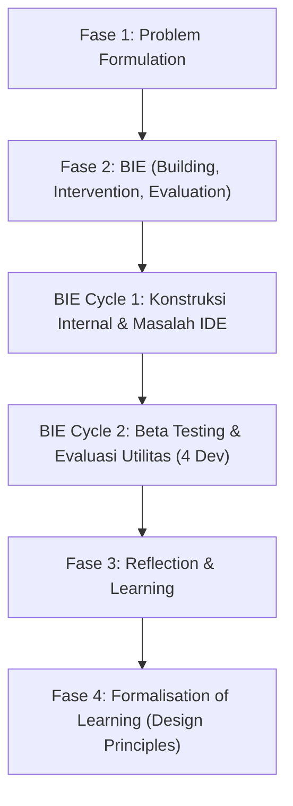

# Catatan Membaca Mendalam (Reading Notes) — Paper 2
## Menggunakan Development Environment as Code untuk Meningkatkan Developer Experience

---

## 1. Identitas Paper & Catatan Pengecualian Tahun

*   **Judul Paper**: Using development environment as code for enhancing developer experience: An action design research study
*   **Penulis**: Hadi Ghanbari, Tarmo Terimaa, Kari Koskinen
*   **Afiliasi**: Aalto University School of Business, Finlandia
*   **Jurnal Penerbit**: *The Journal of Systems and Software* (JSS), Elsevier Inc.
*   **Volume & Halaman**: Volume 236, Artikel 112803
*   **Editor Jurnal**: Dr. Alexander Chatzigeorgiou
*   **DOI**: https://doi.org/10.1016/j.jss.2026.112803
*   **Status Review & Publikasi**: Diterima (Accepted) 1 Februari 2026, Dipublikasikan online Februari 2026.

> [!NOTE]
> **Catatan Pengecualian Akademis (Tahun Terbit 2026)**
> Paper ini diterbitkan secara resmi pada awal tahun 2026 di jurnal bereputasi tinggi Q1 Scopus/Web of Science (*Journal of Systems and Software*, JSS Elsevier). Meskipun kebijakan umum tugas kuliah DevOps biasanya membatasi referensi maksimal 5 tahun terakhir (misal: hingga tahun 2024/2025), paper ini disetujui sebagai pengecualian khusus oleh dosen pengampu karena menyajikan kontribusi terdepan (SOTA - *State of the Art*) yang secara eksplisit menghubungkan otomatisasi lokal (*Development Environment as Code*) dengan peningkatan kesejahteraan pengembang (*Developer Experience* - DX).

---

## 2. Klaim Utama & Metodologi Action Design Research (ADR)

### A. Klaim Utama Paper
Paper ini mengklaim bahwa proses manual dalam mengonfigurasi dan melakukan pengaturan (*setup*) lingkungan pengembangan lokal (*local development environment*) sangat melelahkan, memakan waktu, dan rentan terhadap kesalahan (*error-prone*), yang secara langsung menurunkan *Developer Experience* (DX) serta meningkatkan beban kognitif pengembang. Sebagai solusinya, penulis memperkenalkan konsep **Development Environment as Code** (DEaC)—yaitu pemanfaatan kontainerisasi dan otomatisasi deklaratif berbasis kode untuk mengotomatiskan setup lingkungan kerja pengembang secara konsisten, andal, dan mandiri (*self-service*).

### B. Metodologi Penelitian: Action Design Research (ADR)
Penelitian ini menggunakan kerangka kerja **Action Design Research (ADR)** berdasarkan metodologi Sein et al. (2011). ADR memadukan pemecahan masalah praktis dalam organisasi dengan kontribusi teoritis melalui perancangan artefak IT. Proses ADR ini dijalankan melalui empat fase utama:

1.  **Problem Formulation**: Mengidentifikasi masalah nyata di perusahaan perangkat lunak Finlandia (omset €25 juta) di mana setup lokal memakan waktu berhari-hari, dokumentasi tidak mutakhir (*outdated*), dan informasi tersebar (*scattered info*). Tim peneliti merumuskan persyaratan desain berdasarkan kebutuhan pengguna.
2.  **Building, Intervention, Evaluation (BIE)**: Fase pengembangan iteratif yang melibatkan intervensi langsung pada organisasi.
    *   **BIE Cycle 1 (Konstruksi Internal)**: Membangun kontainer PostgreSQL, server Tomcat/Java/Node, dan kontainer *build* terisolasi. Peneliti mendeteksi masalah integrasi dengan IntelliJ IDEA (ketiadaan fitur *incremental build* pada mode isolasi penuh). Solusinya adalah memasang dua versi *build tools* (di mesin *host* dan mesin *guest* kontainer) serta memisahkan service `tools` khusus.
    *   **BIE Cycle 2 (Uji Coba & Intervensi Luas)**: Menguji versi beta ke 4 pengembang. Uji coba menunjukkan bahwa konfigurasi yang awalnya memakan waktu berhari-hari kini selesai dalam waktu kurang dari 15 menit melalui dua perintah Docker.
3.  **Reflection and Learning**: Melakukan refleksi terhadap hasil penggunaan artefak secara riil. Ditemukan bahwa kegunaan DEaC meluas bukan hanya untuk pengembang aktif, melainkan juga untuk anggota non-teknis (seperti *Product Owner*) yang ingin melakukan review lokal dengan cepat.
4.  **Formalisation of Learning**: Menggeneralisasi hasil menjadi kontribusi teoritis yang lebih luas berupa empat prinsip desain (*Design Principles*) yang divalidasi oleh 6 praktisi eksternal independen.

---

## 3. Konsep DEaC vs IaC (Development Environment vs Infrastructure as Code)

Meskipun DEaC mengadopsi teknik otomatisasi deklaratif seperti IaC, kedua konsep ini memiliki perbedaan mendasar dalam hal cakupan, tujuan, dan dampak operasional:

| Aspek Perbandingan | Infrastructure as Code (IaC) | Development Environment as Code (DEaC) |
| :--- | :--- | :--- |
| **Cakupan (*Scope*)** | Global, meliputi keseluruhan infrastruktur TI (Cloud VM, virtual networks, API Gateway, server produksi). | Lokal, hanya mencakup perkakas, dependensi, dan *library* yang dipasang di dalam mesin lokal pengembang. |
| **Tujuan Utama (*Purpose*)** | Mengotomatiskan penyediaan (*provisioning*) dan pengelolaan resource cloud/server secara global. | Mengotomatiskan setup, konfigurasi, dan standardisasi lingkungan kerja lokal sehari-hari pengembang. |
| **Manfaat Operasional** | Meningkatkan kecepatan rilis, mencegah *configuration drift* pada staging/produksi, serta efisiensi biaya infrastruktur. | Mengurangi beban kognitif pengembang, meminimalkan bug "works-on-my-machine", dan mempercepat *onboarding*. |
| **Kebijakan Modifikasi** | Dikelola dan diedit secara ketat oleh tim operasi/DevOps untuk menghindari kerusakan infrastruktur global. | Dapat diedit dan disesuaikan secara bebas oleh pengembang lokal tanpa risiko merusak lingkungan produksi. |
| **Konteks Penggunaan** | Menjaga stabilitas aplikasi pada lingkungan rilis (*runtime environments*). | Berfungsi sebagai *sandbox* terisolasi untuk pengembangan, debugging, reproduksi bug, dan review lokal. |

---

## 4. Empat Prinsip Desain (Design Principles - DPs) & Hubungannya ke Golden Path Kita

Paper Ghanbari et al. (2026) merumuskan 4 Design Principles (DP1–DP4) untuk membangun solusi DEaC yang efektif meningkatkan DX:

### DP1: Design for Automated Setup of Development Environment
*   *Deskripsi*: Tentukan lingkungan pengembangan sebagai kode yang mencakup paket perangkat lunak, dependensi, dan rutinitas setup otomatis agar proses instalasi menjadi instan dan meminimalisir intervensi manual.
*   *Penerapan pada Golden Path Kita*: Kita telah mengotomatiskan setup pipeline CI/CD (`.gitlab-ci.yml`) dan menyediakan Helm Chart (`golden-path-chart/`) sehingga pengembang tidak perlu menulis file deployment Kubernetes dari awal. Cukup salin template dan jalankan.

### DP2: Design for a Consistent Development Environment
*   *Deskripsi*: Gunakan teknologi virtualisasi atau kontainerisasi agar lingkungan pengembangan lokal sama persis dengan lingkungan testing dan produksi, guna memfasilitasi transisi mulus dan menghindari isu inkonsistensi.
*   *Penerapan pada Golden Path Kita*: Kita mendefinisikan *base image* yang seragam dan melakukan deployment ke klaster Minikube lokal menggunakan konfigurasi namespace terisolasi (`namespace.yaml`), deployment limits (`deployment.yaml`), serta port-binding terstandar.

### DP3: Design for a Modular Development Environment
*   *Deskripsi*: Buat lingkungan pengembangan yang modular sehingga pengembang dapat menyesuaikan (*customize*) atau menggunakan bagian tertentu saja tanpa mengganggu perkakas yang sudah terpasang di sistem operasi utama.
*   *Penerapan pada Golden Path Kita*: Arsitektur Helm Chart kita didesain sangat modular dengan variabel di `values.yaml` (seperti jumlah replika, resource limits, port). Developer bebas mengubah parameter di tingkat swalayan tanpa merusak manifes Kubernetes global.

### DP4: Design for Embedding Knowledge into Development Environments
*   *Deskripsi*: Integrasikan instruksi setup, skrip instalasi, dan dokumentasi operasional langsung ke dalam repositori kode DEaC agar mengurangi waktu pencarian informasi yang tersebar.
*   *Penerapan pada Golden Path Kita*: Kita memusatkan semua panduan operasional pengembang Go dan tabel troubleshooting langsung ke dalam `golden-path/README.md`, sehingga pengetahuan teknis terdokumentasi rapi di satu tempat.

---

## 5. Hasil Empiris BIE Cycles

Selama uji coba beta (BIE Cycle 2), implementasi DEaC di perusahaan kasus menunjukkan hasil empiris sebagai berikut:
*   **Pengurangan Waktu Setup**: Pengaturan lingkungan pengembangan yang semula membutuhkan waktu **1 hingga beberapa hari** (karena instalasi manual, troubleshooting versi Java/Tomcat, dan pencarian dokumentasi usang) dipotong secara drastis menjadi hanya **15 menit** menggunakan dua perintah Docker.
*   **Penurunan Beban Kognitif**: Pengembang tidak lagi mengalami stres akibat kebingungan mencari dokumen yang tercecer di Slack atau Wiki perusahaan. Pemrosesan instalasi didelegasikan secara otomatis ke kontainer Docker.
*   **Kemudahan Kolaborasi Lintas Proyek**: Anggota tim non-pengembang (seperti Product Owner) dapat menjalankan aplikasi secara lokal dalam hitungan menit untuk menguji integrasi fitur baru sebelum menyetujui rilis ke produksi.

---

## 6. Relevansi & Perbedaan dengan Proyek Kita

### Relevansi
Paper ini sangat relevan sebagai landasan teoretis untuk proyek **Golden Path** kelompok kami. Konsep DEaC memvalidasi keputusan kami untuk membungkus manifes deployment aplikasi ke dalam template siap pakai (GitLab CI & Helm) guna membebaskan pengembang dari beban kognitif memahami konfigurasi Kubernetes yang rumit.

### Perbedaan
*   **Fokus Solusi**: Solusi di paper Ghanbari et al. terfokus pada otomatisasi **mesin lokal pengembang** (IDE, *local build tools*, Tomcat, Node, local DB) agar pengembang dapat langsung menulis kode dengan cepat di komputernya. Sementara itu, proyek **Golden Path** kelompok kami fokus pada otomatisasi jalur deployment dari kode ke **infrastruktur Kubernetes** (Minikube lokal, namespace dev/prod, Helm, dan GitLab CI/CD).
*   **Teknologi**: Paper menggunakan Docker Compose untuk mengorkestrasi server lokal dan database pengembang di satu komputer. Proyek kami melangkah lebih jauh dengan menerapkan orkestrasi Kubernetes (`kubectl wait`, `NodePort` Services, `securityContext`, namespace isolation) yang siap menuju skala produksi.

---

## 7. Keterbatasan Paper

Berdasarkan analisis kritis terhadap paper ini, kami mengidentifikasi beberapa keterbatasan ilmiah:
1.  **Ancaman Validitas Eksternal (Generalizability)**: Penelitian ini dikembangkan dan dievaluasi hanya dalam konteks satu perusahaan perangkat lunak di Finlandia (studi kasus tunggal). Karakteristik lingkungan pengembang di perusahaan skala besar atau sektor industri lain mungkin berbeda.
2.  **Degradasi Performa Kecepatan Run**: Lingkungan pengembangan yang didekatkan pada kontainerisasi (DEaC) memiliki waktu muat ulang (*server restart time*) yang lebih lambat dibanding bare-metal lokal karena overhead dari virtualisasi Docker.
3.  **Hambatan Kebiasaan Pengembang**: Adopsi DEaC menuntut perubahan kebiasaan kerja pengembang senior yang sudah terbiasa dengan konfigurasi lokal manual mereka (seperti kustomisasi tombol pintas IDE/keyboard shortcuts). Hal ini berpotensi menimbulkan resistensi budaya dalam tim.

---

## 8. Pertanyaan Kritis untuk Diskusi (Satu Hal yang Dipertanyakan)

> *“Bagaimana organisasi dapat menjamin efisiensi pemeliharaan DEaC jangka panjang ketika dependensi versi perkakas lokal pengembang (seperti versi IDE, OS patches host, dan Docker Desktop) terus berkembang pesat tanpa memicu overhead baru bagi tim platform?”*

**Penjelasan**: Otomatisasi ini berisiko memindahkan beban kerja dari "masalah pengembang lokal" menjadi "masalah tim platform" yang harus terus-menerus memperbarui dan menambal kode DEaC agar kompatibel dengan sistem operasi pengembang yang selalu berubah. Jika tidak dikelola dengan tata kelola (*governance*) yang ketat, hal ini dapat melahirkan bentuk utang teknis (*technical debt*) baru.

---

## 9. Implikasi untuk Implementasi Kita

Hasil studi paper kedua ini memberikan implikasi penting bagi proyek Golden Path kita:
1.  **Pentingnya Kecepatan Feedback Loop**: Mengingat keluhan developer di paper mengenai lambatnya restart server kontainer, kita harus memastikan container build kita ringan (seperti multi-stage build Go berbasis `scratch` yang telah kita buat) untuk meminimalkan waktu tunggu.
2.  **Dokumentasi yang Living (Selalu Update)**: Kita harus menghindari dokumentasi usang dengan memastikan instruksi troubleshooting (tabel error pada README) terus diperbarui secara berkala berdasarkan kendala dry-run riil.
3.  **Kustomisasi Tanpa Merusak Standar**: Template `values.yaml` pada Helm chart kita harus didokumentasikan dengan jelas agar developer mengerti parameter apa saja yang boleh dimodifikasi sendiri secara mandiri tanpa merusak standardisasi keamanan.
